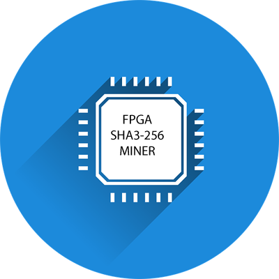
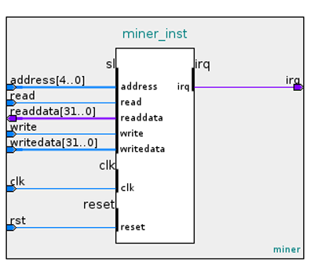
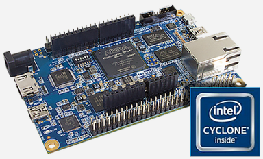

# DE10 NANO SHA3 Miner Core



Want to support this open source project? Please star it. Want to contribute?
Feel free to create pull requests following the normal github process.

## Table of Contents

* [Introduction](#introduction)
* [Implementation](#implementation)
* [Miner Component](#miner_component)
	* [Block diagram](#block_diagram)
	* [API](#api)
* [Building](#building)
   * [Prerequisites](#prerequisites)
   * [Synthesizing](#synthesizing)
* [Sample](#sample)
* [Disclaimer](#disclaimer)

## Introduction

In mining a proof-of-work (POW) is used to verify the authenticity of a blockchain entry. What is a POW?
A POW is a mathematical puzzle which is difficul to solve but easy to verify.

For this example an FPGA mining core is defined for a hypothetical blockchain that uses the SHA3-256 hash.

We are given:

- H: 256 bit header of fixed value
- N: 64 bit nonce
- D: 256 bit difficulty

The problem we need to solve is to find any value of N, such that the SHA3-256 hash of the nonce concatenated
to the header, is less than or equal to the difficulty:

D >= SHA3({H, N})

NOTE: This will not mine a real blockchain. It would be well suited to mine the ETC chain as proposed
in [ECIP-1049](https://github.com/ethereumclassic/ECIPs/issues/13)

## Implementation

A Quartus project is presented for the
[DE10 NANO](https://software.intel.com/content/www/us/en/develop/topics/iot/hardware/fpga-de10-nano.html),
a low cost FPGA development board equipped with an Intel 5CSEBA6U23I7NDK FPGA. The FPGA includes a dual
core ARM hard processor able to run Linux, used in
[this](https://github.com/miscellaneousbits/linux-socfpga-sha3-miner.git)
project to test the core.  The low cost Cyclone V FPGA can produce and verify over 30 million hashes
per second using 10 watts of power. Not great, could do much better with a faster FPGA and
specialized PCB. There's lots of unneeded stuff on the DE10 NANO.

An 8 stage pipeline design is used in three phases since a fully unrolled
24 stage pipeline exceeds the capacity of this FPGA.

## Miner Component

The component is an Avalon bus slave with a 23 word memory mapped register file for control and status.
The Avalon bus is the bus used by the ARM cores in the SOCFPGA system. The mining core IP is located
in directory **miner_ip**.

### Block diagram



| Signal | Description|
| --- | --- |
| CLK| 50MHz Avalon bus clock (1-bit input) |
| RST | Asynchronous reset (1-bit input) |
| ADDRESS | 32-bit word addrees (5-bit input) |
| READ | read strobe (1-bit input) |
| READDATA | read data (32-bit output) |
| WRITE | write strobe (1-bit input) |
| WRITEDATA | write data (32-bit input) |
| IRQ | Ative high when solution found (1-bit output) |

### API

#### Register file

| Reg. # | Name | Read/Write | Description|
| --- | --- | --- | --- |
| 0-1 | SOLN_REG | RO | 64-bit Solution |
| 2 | STATUS_REG | RO | Status (see below) |
| 3 | SHA3_REG | RO | Fingerprint "SHA3" |
| 4-11 | HDR_REG | RW | 256-bit Header |
| 12-19 | DIFF_REG | RW | 256-bit difficulty |
| 20-21 | START_REG | RW | 64-bit start nonce |
| 22 | CTL_REG | RW | Control (see below) |

#### Status register

| Bit # | Name | Description |
| --- | --- | --- |
| 0 | FOUND | Solution found. Solution is stored and IRQ is set. IRQ cleared with next ctl. reg. read. |
| 1 | RUNNING | The run ctl bit is set and the solution nonce is auto-incrementing |
| 2 | TESTING | The test ctl bit is set and compare diff equal |
| 15-8 | MINER_FREQ | Miner clock frequency in MHZ |
| 19-16 | MAJ_VER | Miner core major version |
| 23-20 | MIN_VER | Miner core minor version |

#### Control register

| Bit # | Name | Description |
| --- | --- | --- |
| 0 | RUN | 0 - clear, 1 - auto increment the solution nonce and check hashes |
| 1 | TEST | 0 - normal mode, 1 - test mode, look for exact match with diff |
| 2 | HALT | 0 - normal mode, 1 - halt mining and raise interrupt |
| 23-16 | PAD_LAST | last pad byte, 0x80 for KECCACK-256 and SHA3-256 |
| 31-24 | PAD_FIRST | first pad byte, 0x01 for KECCACK-256, and 0x06 for SHA3-256 |

## Building

### Prerequisites



- DE10-NANO
- X86 Desk/Laptop (Windows or Linux Ubuntu/Debian) to run Quartus.
- Quartus 18.1 Free Edition, available [here](https://fpgasoftware.intel.com/?edition=lite)
- Intel SoC FPGA Embedded Development Suite Standard Edition, available [here](https://fpgasoftware.intel.com/soceds/20.1/?edition=standard)

### Synthesizing

From the command line:
```
git clone https://github.com/miscellaneousbits/DE10_NANO_SOC_MINIMAL.git
cd DE10_NANO_SOC_MINIMAL
make sof
./makerbf
ls output_files/DE10_NANO_SOC_GHRD.rbf
```
This will create the .rbf (bitstream) needed to configure the FPGA.

## Sample

This test was run under a Ubuntu Linux kernel on the DE10-NANO SOC. See
[this](https://github.com/miscellaneousbits/linux-socfpga-sha3-miner.git)
project for kernel source tree, miner kernel driver, and pre-built bootable
SD card image.


```
root@de10nano:~# cd linux-socfpga-sha3-miner/tools/testing/miner/
root@de10nano:~/linux-socfpga-sha3-miner/tools/testing/miner# make
main.c -> main.o
sha3.c -> sha3.o
main.o sha3.o -> test
root@de10nano:~/linux-socfpga-sha3-miner/tools/testing/miner# ./test

Permutation stage test

Test 0 407e0758049d0b43 ................................................
Test 1 582acaed0a5b2461 ................................................
Test 2 783c26f63f572ed8 ................................................
Test 3 6b4d3be558640236 ................................................
Test 4 100e19fc5bb454bc ................................................
Test 5 472bec212ebc9746 ................................................
Test 6 4a4ceb022c632c02 ................................................
Test 7 4769389949d7c4e6 ................................................
Test 8 402ecfda45b559ed ................................................
Test 9 263cc2ad13c68104 ................................................
PASS

Interrupt test

Test 0 1c39c47e0a343594 ................................................
Test 1 5774c4a41d654b74 ................................................
Test 2 38cd2c903d4f61a8 ................................................
Test 3 64ba1fdb75250e7d ................................................
Test 4 230a37d027d8fc18 ................................................
Test 5 7fa75b5279c17342 ................................................
Test 6 44141d410d935089 ................................................
Test 7 7f86870c3fe0fa5d ................................................
Test 8 273b032b331bfb8e ................................................
Test 9 56c541f173231eb6 ................................................
PASS

Hash rate test

Miner clock 93 MHz, pipeline stages 8, expected hash rate 31.00 MH/S
Measured 31.00 MH/S
PASS

Mining test

Search 1
Header:     8c70c521f02d6c0d2e5bf63c580e19596006ee44a2f78b59639f37221457f31f
Start:      59dc07574dc801a2
Solution:   59dc075750f39248 (53,186,726 hashes)
Hash:       0000000189ffbac8ce8d11e655a700ab78892d379227becac54fdbed98f2fa78
Difficulty: 00000007ffffffffffffffffffffffffffffffffffffffffffffffffffffffff
PASS

Search 2
Header:     10836d3238fe0265629bdc49c237032a06715a29310aab5d4a3d5821a7990a7c
Start:      5ad3f8a135ac2f9a
Solution:   5ad3f8a1841dbcc8 (1,316,064,558 hashes)
Hash:       000000054f0279237c0cc086e2c95afd231514925567f0d9b1df63092870defb
Difficulty: 00000007ffffffffffffffffffffffffffffffffffffffffffffffffffffffff
PASS

Search 3
Header:     d6a1cd543ab6591d6a2d5d465ed979148e7c0874d3b960027da0f201df2aa114
Start:      6cb423f27e56b7ae
Solution:   6cb423f283995212 (88,250,980 hashes)
Hash:       00000003c031045e1117b61c13d9689e5ba4e69d4b70cf33e6b1ced8f1ae585c
Difficulty: 00000007ffffffffffffffffffffffffffffffffffffffffffffffffffffffff
PASS

Search 4
Header:     aac179487e94790e9ee5c20bd81c7005d7a29267feebb0507b14fc5e3a42ca09
Start:      70a4431238d81bd2
Solution:   70a44312bf88d8c6 (2,259,729,652 hashes)
Hash:       000000068019e27f3aecb15ab5ba7b8d44c5ba8ab913a21502c647358703fb68
Difficulty: 00000007ffffffffffffffffffffffffffffffffffffffffffffffffffffffff
PASS

Search 5
Header:     dc43925723c611230a1adb1d3fdf6e21e5fd144d108b354770e9197f303b6d6e
Start:      434024b759ede211
Solution:   434024b76391f6cc (161,748,155 hashes)
Hash:       00000000ea972c480a4386347bdb9765f847c7d3fe0434d875737b4ce616da1f
Difficulty: 00000007ffffffffffffffffffffffffffffffffffffffffffffffffffffffff
PASS

Search 6
Header:     ca6a19248dc60d184b9847773498766aec9f872cd914506b0752d76c69407a2e
Start:      7ff13fb9598b75fa
Solution:   7ff13fb95f36fb91 (95,126,935 hashes)
Hash:       00000002e97e6b6c814c85a4bf38dcac30a07c69893ab7e88cada26fc774f853
Difficulty: 00000007ffffffffffffffffffffffffffffffffffffffffffffffffffffffff
PASS

Search 7
Header:     17f8d02c63016b48780a0568b5dd93383c1edb4d4fad974fb3c94409b732d72c
Start:      5961ef8979e90cc6
Solution:   5961ef898edca07b (351,507,381 hashes)
Hash:       00000006acce4539f97d0610957b7e93d3b8aecbe9d4933a034f89e4b8815926
Difficulty: 00000007ffffffffffffffffffffffffffffffffffffffffffffffffffffffff
PASS

Search 8
Header:     894eaf656633f430e9d2fa1c93688a03a5126352ced00f6aa4f3bf4a15fc7c51
Start:      587d0bfe0e00185b
Solution:   587d0bfe1c25ecc0 (237,360,229 hashes)
Hash:       000000016283025bc9db671f42549f1ce8d9468a147567446d8634af91a07e73
Difficulty: 00000007ffffffffffffffffffffffffffffffffffffffffffffffffffffffff
PASS

Search 9
Header:     26de6a2bc876967ce9de0d267176b222fc0e0d67d57e95524a8b020e0461e453
Start:      010fbf3e0df3cb03
Solution:   010fbf3e28c7f27a (450,111,351 hashes)
Hash:       00000007c8f5966cf709f935618e5ee7f1530d721cb287e5bd2233db03306549
Difficulty: 00000007ffffffffffffffffffffffffffffffffffffffffffffffffffffffff
PASS

Search 10
Header:     fed66f2d55b7e02d67cc5e5676e174150a957466a3ea3924c68e0c65bd5eb96f
Start:      51111d5a3e6e7e4f
Solution:   51111d5a7ec004d0 (1,079,084,673 hashes)
Hash:       000000007d6548b93febbe7811c7b454e9db4a8ab995e3b76a20a133f202e502
Difficulty: 00000007ffffffffffffffffffffffffffffffffffffffffffffffffffffffff
PASS

root@de10nano:~/linux-socfpga-sha3-miner/tools/testing/miner# 
```

## Disclaimer

This software is provided "AS IS" and any expressed or implied warranties, including, but not limited to, the implied warranties of merchantability and fitness for a particular purpose are disclaimed. In no event shall the regents or contributors be liable for any direct, indirect, incidental, special, exemplary, or consequential damages (including, but not limited to, procurement of substitute goods or services; loss of use, data, or profits; or business interruption) however caused and on any theory of liability, whether in contract, strict liability, or tort (including negligence or otherwise) arising in any way out of the use of this software, even if advised of the possibility of such damage.  
