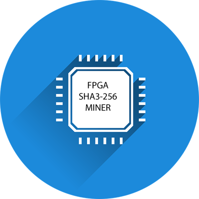

# DE10 NANO SHA3 Miner Core



Want to support this open source project? Please star it.

## Table of Contents

* [Introduction](#introduction)
* [Implementation](#implementation)
* [Miner Component](#miner_component)
	* [Block diagram](#block_diagram)
	* [API](#api)
* [Building](#building)
   * [Prerequisites](#prerequisites)
   * [Synthesizing](#synthesizing)
* [Disclaimer](#disclaimer)

## Introduction

In mining a proof-of-work (POW) is used to verify the authenticity of a blockchain entry. What is a POW?
A POW is a mathematical puzzle which is difficul to solve but easy to verify.

For this example an FPGA mining core is defined for a hypothetical blockchain that uses the SHA3-256 hash.

We are given:

- H: 256 bit header of fixed value
- N: 64 bit nonce
- D: 256 bit difficulty

The problem we need to solve is to find any value of N, such that the SHA3-256 hash of the nonce concatenated
to the header, is less than or equal to the difficulty:

D >= SHA3({H, N})

NOTE: This will not mine a real blockchain. It would be well suited to mine the ETC chain as proposed
in [ECIP-1049](https://github.com/ethereumclassic/ECIPs/issues/13)

## Implementation

A Quartus project is presented for the DE10 NANO, a low cost FPGA development board equipped with
an Intel 5CSEBA6U23I7NDK FPGA. The FPGA includes a dual core ARM hard processor able to run Linux,
used in [this](https://github.com/miscellaneousbits/linux-socfpga-sha3-miner.git) project to test the core.
The low cost Cyclone V FPGA can produce and verify over 25 million hashes
per second using under 5 watts of power.

An 8 stage pipeline is used in three phases since a fully unrolled
24 stage pipeline exceeds the capacity of this FPGA.

## Miner Component

The component is an Avalon bus slave with a 23 word memory mapped register file for control and status.
The Avalon bus is the bus used by the ARM cores in the SOCFPGA system. The mining core IP is located
in directory quartus/miner_ip

### Block diagram


| Signal | Description|
| --- | --- |
| CLK| 50MHz Avalon bus clock (1-bit input) |
| RST | Asynchronous reset (1-bit input) |
| ADDRESS | 32-bit word addrees (5-bit input) |
| READ | read strobe (1-bit input) |
| READDATA | read data (32-bit output) |
| WRITE | write strobe (1-bit input) |
| WRITEDATA | write data (32-bit input) |
| IRQ | Ative high when solution found (1-bit output) |

### API

#### Register file

| Reg. # | Name | Read/Write | Description|
| --- | --- | --- | --- |
| 0-1 | SOLN_REG | RO | 64-bit Solution |
| 2 | STATUS_REG | RO | Status (see below) |
| 3 | SHA3_REG | RO | Fingerprint "SHA3" |
| 4-11 | HDR_REG | RW | 256-bit Header |
| 12-19 | DIFF_REG | RW | 256-bit difficulty |
| 20-21 | START_REG | RW | 64-bit start nonce |
| 22 | CTL_REG | RW | Control (see below) |

#### Status register

| Bit # | Name | Description |
| --- | --- | --- |
| 0 | FOUND | Solution found. Solution is stored and IRQ is set. IRQ cleared with next read. |
| 1 | RUNNING | The run ctl bit is set and the nonce is auto-incrementing |
| 2 | TESTING | The test ctl bit is set and compare diff equal |
| 15-8 | MINER_FREQ | Miner clock frequency in MHZ |
| 19-16 | MAJ_VER | Miner core major version |
| 23-20 | MIN_VER | Miner core minor version |

#### Control register

| Bit # | Name | Description |
| --- | --- | --- |
| 0 | RUN | 0 - clear, 1 - auto increment the nonce and check hashes |
| 1 | TEST | 0 - normal mode, 1 - test mode, look for exact match with diff |
| 2 | HALT | 0 - normal mode, 1 - halt mining and raise interrupt |
| 23-16 | PAD_LAST | last pad byte, 0x80 for KECCACK-256 and SHA3-256 |
| 31-24 | PAD_FIRST | first pad byte, 0x01 for KECCACK-256, and 0x06 for SHA3-256 |

## Building

### Prerequisites

- Quartus 20.1 Free Edition, available [here](https://fpgasoftware.intel.com/?edition=lite)
- Intel SoC FPGA Embedded Development Suite Standard Edition, available [here](https://fpgasoftware.intel.com/soceds/20.1/?edition=standard)

### Synthesizing

From the command line:
```
git clone https://github.com/miscellaneousbits/DE10_NANO_SOC_MINIMAL.git
cd DE10_NANO_SOC_MINIMAL/quartus
make sof
./makerbf
ls output_files/DE10_NANO_SOC_GHRD.rbf
```
This will create the .rbf (bitstream) needed to configure the FPGA.

## Disclaimer

This software is provided "AS IS" and any expressed or implied warranties, including, but not limited to, the implied warranties of merchantability and fitness for a particular purpose are disclaimed. In no event shall the regents or contributors be liable for any direct, indirect, incidental, special, exemplary, or consequential damages (including, but not limited to, procurement of substitute goods or services; loss of use, data, or profits; or business interruption) however caused and on any theory of liability, whether in contract, strict liability, or tort (including negligence or otherwise) arising in any way out of the use of this software, even if advised of the possibility of such damage.  
