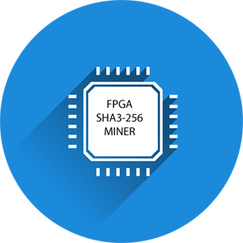

# DE10 NANO SHA3 Miner Core



Want to support this open source project? Please star it. Want to contribute?
Feel free to create pull requests following the normal github process.

## Table of Contents

* [Introduction](#introduction)
* [Implementation](#implementation)
* [Miner Component](#miner_component)
	* [Block diagram](#block_diagram)
	* [API](#api)
* [Building](#building)
   * [Prerequisites](#prerequisites)
   * [Synthesizing](#synthesizing)
* [Sample](#sample)
* [Disclaimer](#disclaimer)

## Introduction

In mining a proof-of-work (POW) is used to verify the authenticity of a blockchain entry. What is a POW?
A POW is a mathematical puzzle which is difficul to solve but easy to verify.

For this example an FPGA mining core is defined for a hypothetical blockchain that uses the SHA3-256 hash.

We are given:

- H: 256 bit header of fixed value
- N: 64 bit nonce
- D: 256 bit difficulty

The problem we need to solve is to find any value of N, such that the SHA3-256 hash of the nonce concatenated
to the header, is less than or equal to the difficulty:

D >= SHA3({H, N})

NOTE: This will not mine a real blockchain. It would be well suited to mine the ETC chain as proposed
in [ECIP-1049](https://github.com/ethereumclassic/ECIPs/issues/13)

## Implementation

A Quartus project is presented for the
[DE10 NANO](https://software.intel.com/content/www/us/en/develop/topics/iot/hardware/fpga-de10-nano.html),
a low cost FPGA development board equipped with an Intel 5CSEBA6U23I7NDK FPGA. The FPGA includes a dual
core ARM hard processor able to run Linux, used in
[this](https://github.com/miscellaneousbits/linux-socfpga-sha3-miner.git)
project to test the core.  The low cost Cyclone V FPGA can produce and verify over 25 million hashes
per second using under 5 watts of power.

An 8 stage pipeline design is used in three phases since a fully unrolled
24 stage pipeline exceeds the capacity of this FPGA.

## Miner Component

The component is an Avalon bus slave with a 23 word memory mapped register file for control and status.
The Avalon bus is the bus used by the ARM cores in the SOCFPGA system. The mining core IP is located
in directory **miner_ip**.

### Block diagram


| Signal | Description|
| --- | --- |
| CLK| 50MHz Avalon bus clock (1-bit input) |
| RST | Asynchronous reset (1-bit input) |
| ADDRESS | 32-bit word addrees (5-bit input) |
| READ | read strobe (1-bit input) |
| READDATA | read data (32-bit output) |
| WRITE | write strobe (1-bit input) |
| WRITEDATA | write data (32-bit input) |
| IRQ | Ative high when solution found (1-bit output) |

### API

#### Register file

| Reg. # | Name | Read/Write | Description|
| --- | --- | --- | --- |
| 0-1 | SOLN_REG | RO | 64-bit Solution |
| 2 | STATUS_REG | RO | Status (see below) |
| 3 | SHA3_REG | RO | Fingerprint "SHA3" |
| 4-11 | HDR_REG | RW | 256-bit Header |
| 12-19 | DIFF_REG | RW | 256-bit difficulty |
| 20-21 | START_REG | RW | 64-bit start nonce |
| 22 | CTL_REG | RW | Control (see below) |

#### Status register

| Bit # | Name | Description |
| --- | --- | --- |
| 0 | FOUND | Solution found. Solution is stored and IRQ is set. IRQ cleared with next ctl. reg. read. |
| 1 | RUNNING | The run ctl bit is set and the solution nonce is auto-incrementing |
| 2 | TESTING | The test ctl bit is set and compare diff equal |
| 15-8 | MINER_FREQ | Miner clock frequency in MHZ |
| 19-16 | MAJ_VER | Miner core major version |
| 23-20 | MIN_VER | Miner core minor version |

#### Control register

| Bit # | Name | Description |
| --- | --- | --- |
| 0 | RUN | 0 - clear, 1 - auto increment the solution nonce and check hashes |
| 1 | TEST | 0 - normal mode, 1 - test mode, look for exact match with diff |
| 2 | HALT | 0 - normal mode, 1 - halt mining and raise interrupt |
| 23-16 | PAD_LAST | last pad byte, 0x80 for KECCACK-256 and SHA3-256 |
| 31-24 | PAD_FIRST | first pad byte, 0x01 for KECCACK-256, and 0x06 for SHA3-256 |

## Building

### Prerequisites


- DE10-NANO
- X86 Desk/Laptop (Windows or Linux Ubuntu/Debian) to run Quartus.
- Quartus 20.1 Free Edition, available [here](https://fpgasoftware.intel.com/?edition=lite)
- Intel SoC FPGA Embedded Development Suite Standard Edition, available [here](https://fpgasoftware.intel.com/soceds/20.1/?edition=standard)

### Synthesizing

From the command line:
```
git clone https://github.com/miscellaneousbits/DE10_NANO_SOC_MINIMAL.git
cd DE10_NANO_SOC_MINIMAL
make sof
./makerbf
ls output_files/DE10_NANO_SOC_GHRD.rbf
```
This will create the .rbf (bitstream) needed to configure the FPGA.

## Sample

This test was run under a Ubuntu Linux kernel on the DE10-NANO SOC. See
[this](https://github.com/miscellaneousbits/linux-socfpga-sha3-miner.git)
project for kernel source tree, miner kernel driver, and pre-built bootable
SD card image.


```
root@de10nano:~# linux-socfpga-sha3-miner/tools/testing/miner/test

Poll test
Test 0 4c4a10a77c3e1b04 ................................................
Test 1 732f25c31959b540 ................................................
Test 2 29c76192315058f4 ................................................
Test 3 013827a1499b689e ................................................
Test 4 5cebbb8d7af619a1 ................................................
Test 5 480ce24d0ae918a7 ................................................
Test 6 7a61393862b20594 ................................................
Test 7 696a459854359e1b ................................................
Test 8 588af1700eddb841 ................................................
Test 9 7d7db9d074160313 ................................................
PASS

Interrupt test
Test 0 1a8fe6bc4e5f2e6f ................................................
Test 1 790374e16769b24d ................................................
Test 2 67d49c584fa2b3e3 ................................................
Test 3 7f88fb0a00a41faa ................................................
Test 4 48199b6338346a2e ................................................
Test 5 1f300ac01cecf76b ................................................
Test 6 10dda66077e1addb ................................................
Test 7 2cfb613530ea97ba ................................................
Test 8 3bbff0960a7d0a68 ................................................
Test 9 6b7c039f0977d199 ................................................
PASS

Checking hash rate
Miner clock 75 MHz, expected hash rate 25.00 MH/S
Measured 25.00 MH/S, PASS

Mining test

Search 1
Header:   669cb81b17a4ad27311933723db2ce50b9b0720c59ba5f7fcc7d59081c002a25
Start:    0317f6645c0b0e72
Solution: 0317f664747ca296 (410,096,676 hashes)
Hash:     000000058c399aff34d21ef6ae481059621ede2237a510ac3c2fd4ac991b2807
Diff:     00000007ffffffffffffffffffffffffffffffffffffffffffffffffffffffff
PASS

Search 2
Header:   495b3e3e30858344bb963d16ba26e35abd08ee1cd8294e7b85244427dfa23071
Start:    0dad3ea809ab8ec6
Solution: 0dad3ea814530043 (178,745,725 hashes)
Hash:     000000052de3dc41750414c7feb71e604ff38a6de12b0fa1ed505bc65814c8dc
Diff:     00000007ffffffffffffffffffffffffffffffffffffffffffffffffffffffff
PASS

Search 3
Header:   7917245104373d5983221757224af22dce9cc261c53aeb1244ce4007ebe13c11
Start:    727ec69e1e7e34f0
Solution: 727ec69e3765652d (417,804,349 hashes)
Hash:     00000005c40ad72e29e1150bff89a7cdcae81041a64ac4b39884999bcaf73d84
Diff:     00000007ffffffffffffffffffffffffffffffffffffffffffffffffffffffff
PASS

Search 4
Header:   fc585d1e0463370e07d92b462d7290104115065fc1899e52872cf00f0d935f67
Start:    77c889dd130822eb
Solution: 77c889dd1a07f691 (117,429,158 hashes)
Hash:     000000058af32a68915fcb867296c496de64fa36e2f80934ab48285331a9fbba
Diff:     00000007ffffffffffffffffffffffffffffffffffffffffffffffffffffffff
PASS

Search 5
Header:   7fa16a4326e506361ba88b573b38a859e00bea10d9b079741362f65466302e38
Start:    65aa53b862a3a0bb
Solution: 65aa53b8a62fc92d (1,133,258,866 hashes)
Hash:     000000007727fdc2b3bebf4d860afa37dccc7fb243a05b8ab5f7ddbb516d6104
Diff:     00000007ffffffffffffffffffffffffffffffffffffffffffffffffffffffff
PASS

Search 6
Header:   2cbfd941316bce36bfd7e03bafe1f01853b5c0648d74a31d741cdc2b9783016c
Start:    2ee056781e5ae312
Solution: 2ee0567859eec762 (999,547,984 hashes)
Hash:     00000001ee82b20f4206c0ea62938cefaf12662727b74f1a276a2d1a474ac9bf
Diff:     00000007ffffffffffffffffffffffffffffffffffffffffffffffffffffffff
PASS

Search 7
Header:   88b87f0a74af3d4d1646922c8f91ab50a121ce5d575b980b501b4a23284ebe6d
Start:    72f7ee651b12a52e
Solution: 72f7ee651d3fc965 (36,512,823 hashes)
Hash:     0000000349ad9e74a6eb2acc312bd8f0a9c647091df29c4e75f8617545881699
Diff:     00000007ffffffffffffffffffffffffffffffffffffffffffffffffffffffff
PASS

Search 8
Header:   1471c600e48f6236548a19512f1952581fc80a103596036208cacb4c322a0165
Start:    1a31c69b32761dc0
Solution: 1a31c69b593c2294 (650,511,572 hashes)
Hash:     000000055387e93086f9c441218b9d0d96f5b7aa62665f7bb5c34b2ab8ad9090
Diff:     00000007ffffffffffffffffffffffffffffffffffffffffffffffffffffffff
PASS

Search 9
Header:   edcaa447c7850b5cf1884469aca285037767fc74443e054e39172921eb83d820
Start:    3a06c1dc50096db1
Solution: 3a06c1dc66066510 (368,899,935 hashes)
Hash:     00000006c1f1c7f9860e99eea77103c500038613d56aad22143f0945a66585a7
Diff:     00000007ffffffffffffffffffffffffffffffffffffffffffffffffffffffff
PASS

Search 10
Header:   fe66333f647a8644251d471d14adc56bf30b3215c73e157b6c085e7744277c38
Start:    68d38cef6a55f6d1
Solution: 68d38cefd6601ae6 (1,812,603,925 hashes)
Hash:     000000013216e14ac8783c13a12d2ffc6efa60c3c9cd98a35066607f6dff8aef
Diff:     00000007ffffffffffffffffffffffffffffffffffffffffffffffffffffffff
PASS

```

## Disclaimer

This software is provided "AS IS" and any expressed or implied warranties, including, but not limited to, the implied warranties of merchantability and fitness for a particular purpose are disclaimed. In no event shall the regents or contributors be liable for any direct, indirect, incidental, special, exemplary, or consequential damages (including, but not limited to, procurement of substitute goods or services; loss of use, data, or profits; or business interruption) however caused and on any theory of liability, whether in contract, strict liability, or tort (including negligence or otherwise) arising in any way out of the use of this software, even if advised of the possibility of such damage.  
